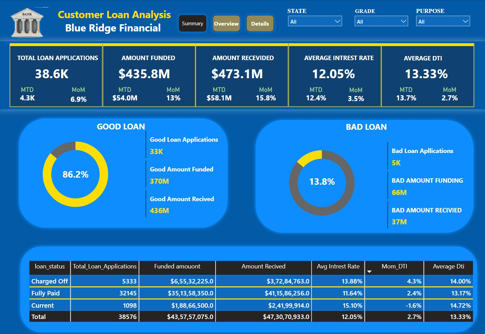
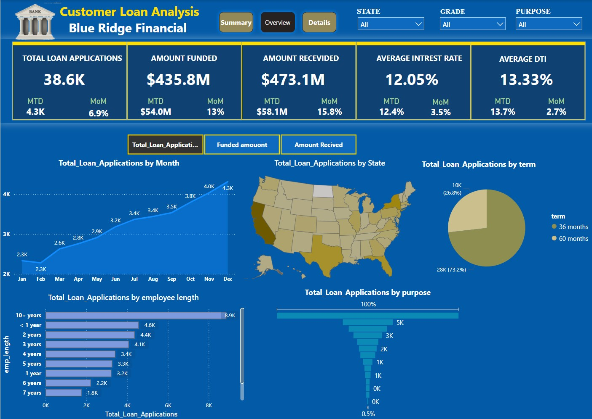
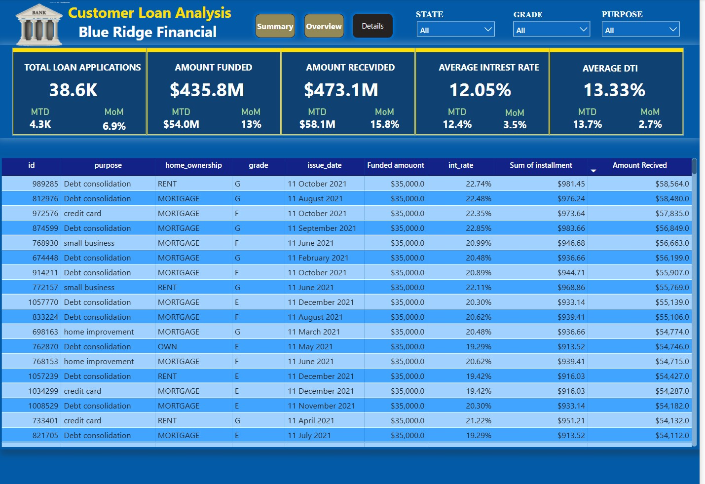

# Loan Analysis Dashboard

This project focuses on the development of a comprehensive Power BI dashboard aimed at analyzing and monitoring key loan performance metrics. The dashboard provides essential insights into loan applications, funded amounts, repayments, interest rates, and borrower financial health. It is designed for financial institutions to optimize decision-making and improve operational efficiency.

## Key Features

- **Loan Applications**: Visualize the total number of loan applications received, along with Month-to-Date (MTD) applications and Month-over-Month (MoM) changes.
- **Total Funded Amount**: Track the total funds disbursed across all loans, with MTD values and MoM changes for better cash flow management.
- **Total Amount Received**: Analyze the total amount received from borrowers in repayments, including MTD and MoM variations.
- **Average Interest Rate**: Monitor the average interest rate across all loans and observe any MoM variations to gauge the overall cost of lending.
- **Average Debt-to-Income Ratio (DTI)**: Assess borrowers' financial health by tracking the average DTI for all loans, MTD, and MoM changes.

## Loan Status Grid View

To gain a comprehensive overview of lending operations, the dashboard features a grid view report categorized by **Loan Status**. This report provides insights into the following key metrics:

- **Total Loan Applications**: Total number of loan applications received.
- **Total Funded Amount**: Total amount of funds disbursed as loans.
- **Total Amount Received**: Total amount repaid by borrowers.
- **Month-to-Date (MTD) Funded Amount**: Amount disbursed in the current month.
- **MTD Amount Received**: Amount repaid in the current month.
- **Average Interest Rate**: The average interest rate across all loans.
- **Average Debt-to-Income Ratio (DTI)**: The average DTI ratio for all borrowers.

This grid view allows users to monitor the performance of loans, identify trends, and make data-driven decisions based on the loan portfolio's health.

## Visuals

- **Monthly Trends by Issue Date (Line Chart)**: Identifies seasonality and long-term trends in lending activities.
- **Regional Analysis by State (Filled Map)**: Highlights regions with significant lending activity and assesses regional disparities in lending.
- **Loan Term Analysis (Donut Chart)**: Shows the distribution of loans across different term lengths, helping the client understand the loan term preferences of borrowers.
- **Employee Length Analysis (Bar Chart)**: Analyzes how lending metrics are distributed among borrowers with different employment lengths, assessing the impact of employment history on loan applications.
- **Loan Purpose Breakdown (Bar Chart)**: Provides a visual breakdown of loan metrics based on the stated purposes of loans, helping to understand the primary reasons borrowers seek financing.
- **Home Ownership Analysis (Tree Map)**: A hierarchical view of how home ownership affects loan applications and disbursements.

## Key Performance Indicators (KPIs)

1. **Total Loan Applications**: 
   - Tracks the total number of loan applications received during the selected period.
   - MTD and MoM analysis to observe trends.

2. **Total Funded Amount**:
   - Monitors the total amount of funds disbursed as loans.
   - Includes MTD and MoM analysis for more granular insights.

3. **Total Amount Received**:
   - Tracks the total amount repaid by borrowers.
   - Includes MTD and MoM variations to assess loan repayment performance.

4. **Average Interest Rate**:
   - Calculates the average interest rate across all loans.
   - Monitors MTD and MoM changes in interest rates to evaluate lending costs.

5. **Average Debt-to-Income Ratio (DTI)**:
   - Evaluates borrowers' average DTI, providing insights into their financial health.
   - Tracks MTD and MoM changes to detect trends.

## Technologies Used

- **Power BI**: For creating interactive dashboards and visualizations.
- **DAX**: For custom calculations, such as MTD, MoM, and KPI measures.
- **Power Query**: For data cleaning and transformation to ensure accurate reporting.

## How to Use

1. **Import Data**: Load loan application and repayment data into Power BI.
2. **Apply Filters**: Use slicers to filter data based on loan type, year, and customer demographics.
3. **Monitor KPIs**: View the key performance metrics, such as the total number of applications, funded amount, received payments, average interest rate, and average DTI.

